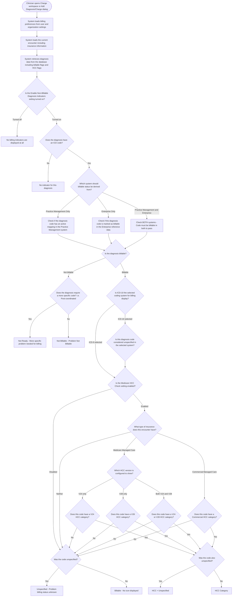
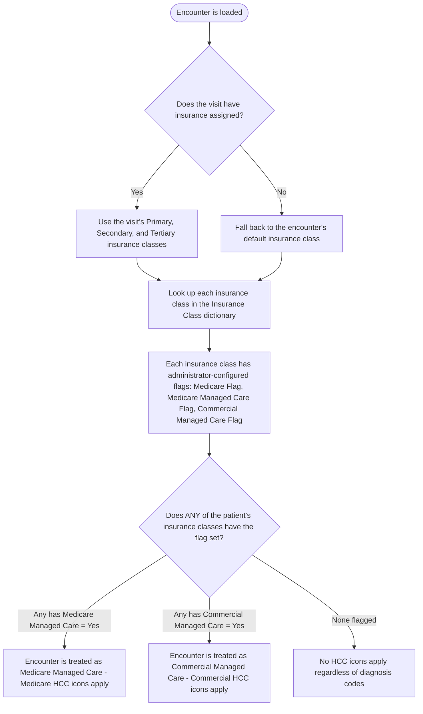
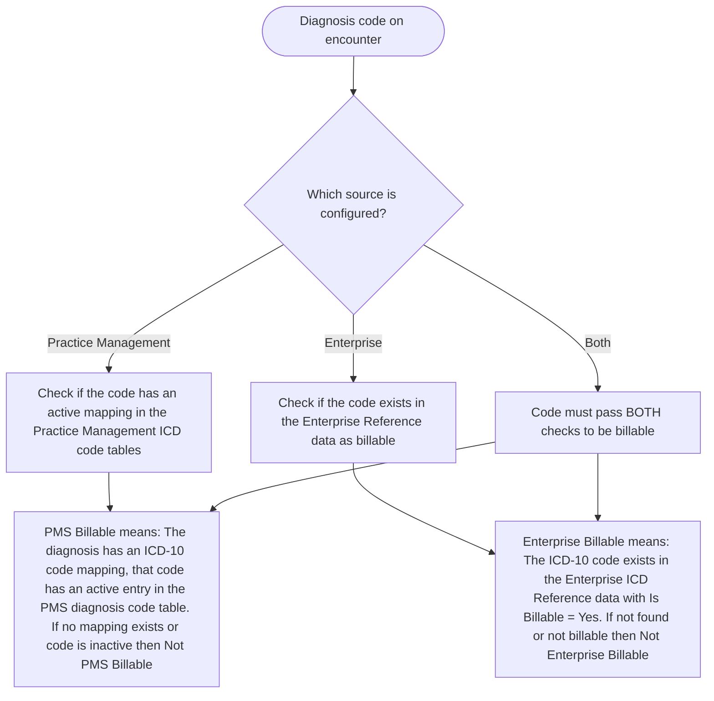

# Charge Workspace — Billing Indicator Derivation Logic (Code-Verified)

## Overview

When a clinician opens the Charge workspace or the Add Diagnosis/Charge dialog, the system displays visual indicators (icons) next to each diagnosis code. These icons communicate whether the diagnosis is billable, requires more specificity, qualifies for a Hierarchical Condition Category (HCC), or cannot be billed.

This document explains the complete logic behind those indicators, verified directly from the **26.1 source code**.

**Source files verified:**
- ChargeModule.js — module/controller bootstrap
- Charge.js — preference loading, grid initialization
- ChargeWorksUtils4.js — billable status, unspecified check, HCC check, icon resolution
- ModalAddDxCharge.js — Add Dx/Charge dialog controller
- dbo.GetV4ChrgWorksEncounter.prc — encounter insurance flag logic
- dbo.DeriveBillableIndicators.prc — server-side billable derivation

---

## Indicator Summary

| Icon | Status | Meaning | When It Appears |
|------|--------|---------|-----------------|
| Red | **Not Billable** | This diagnosis code cannot be billed | Code failed the billable check in the configured system(s) and is not a post-coordinated code |
| Yellow | **Not Ready** | A more specific code is needed before this can be billed | Code failed billable check BUT is flagged as needing post-coordination (a more specific code can be derived) |
| Gray | **Unspecified** | The code is billable but its specificity is unknown | Code is billable, but specificity data indicates it is unspecified (ICD-10 only) |
| Blue | **HCC Category** | This billable code qualifies for a Hierarchical Condition Category | Code is billable + encounter has Medicare or Commercial managed care insurance + code has an HCC category flag |
| Blue+Gray | **HCC + Unspecified** | HCC category applies but code specificity is unknown | Same as HCC but the code is also unspecified |
| None | **Billable** (no icon) | Code is billable, specified, and has no HCC relevance | Code passed all checks cleanly — no icon is needed |

---

## Billing Indicator Derivation — Main Flow

---

## How the System Determines Insurance Type for HCC

The encounter's insurance type determines whether Medicare or Commercial HCC icons can appear. This is resolved when the encounter loads, based on the patient's insurance classes.

---

## How Billable Status Is Determined at the Data Level

---

## Selectability Rule

When the enterprise preference is set to **"Non-billable codes not selectable"**:

- Diagnoses that are **Not Billable** or **Not Ready** are grayed out in the search results
- The clinician **cannot add** these diagnoses to the encounter
- Billable diagnoses remain fully selectable regardless of unspecified or HCC status

---

## Preferences That Control This Logic

| Setting | Who Sets It | Options | Effect |
|---------|------------|---------|--------|
| **Enable Non-Billable Diagnosis Indicators** | Organization administrator (Enterprise level) | Off / On / Non-billable codes not selectable | Controls whether icons appear, and whether non-billable items are blocked from selection |
| **Show Billing Information For** | Individual user | ICD-10 / ICD-9 | Determines which coding system's billable flags are checked. Also controls whether the Unspecified check runs (only runs for ICD-10) |
| **Derive Billing Indicators From** | Individual user | Practice Management Only / Enterprise Only / Practice Management and Enterprise | Determines which data source(s) the billable check uses |
| **Medicare HCC Check** | Organization administrator (Enterprise level) | Yes / No | Enables or disables all HCC icon logic |
| **Medicare Managed HCC Icons** | Individual user | Show only V24 / Show only V28 / Show V24 and V28 | For Medicare encounters, controls which HCC model version icons are displayed |

---

## Where These Indicators Appear

1. **Main Charge workspace** — in the Diagnosis grid (the icon column next to each diagnosis)
2. **Add Diagnosis/Charge dialog** — in the search results grid when searching for diagnoses to add
3. **Summary badge tooltip** — when hovering over the Dx count badge in the Add dialog, the tooltip lists all added diagnoses with their billing icons

---

## HCC Tooltip Details

When an HCC icon is shown, the hover tooltip displays specific information about which HCC model applies:

| Encounter Insurance Type | HCC Preference | Condition | Tooltip Text |
|--------------------------|---------------|-----------|-------------|
| Medicare Managed Care | Show only V24 | Code has V24 HCC flag | V24 HCC Category |
| Medicare Managed Care | Show only V28 | Code has V28 HCC flag | V28 HCC Category |
| Medicare Managed Care | Show V24 and V28 | Code has both V24 and V28 flags | Both V24 and V28 HCC Category |
| Medicare Managed Care | Show V24 and V28 | Code has only V24 flag | V24 HCC Category |
| Medicare Managed Care | Show V24 and V28 | Code has only V28 flag | V28 HCC Category |
| Commercial Managed Care | (any) | Code has Commercial HCC flag | Commercial HCC Category |
| (any with HCC) | (any) | Code is also unspecified | [HCC tooltip] + Problem billing status unknown |

---

*Document generated: August 2026 — Verified from TWEHR 26.1 source code*
