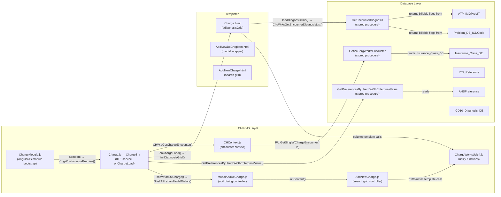
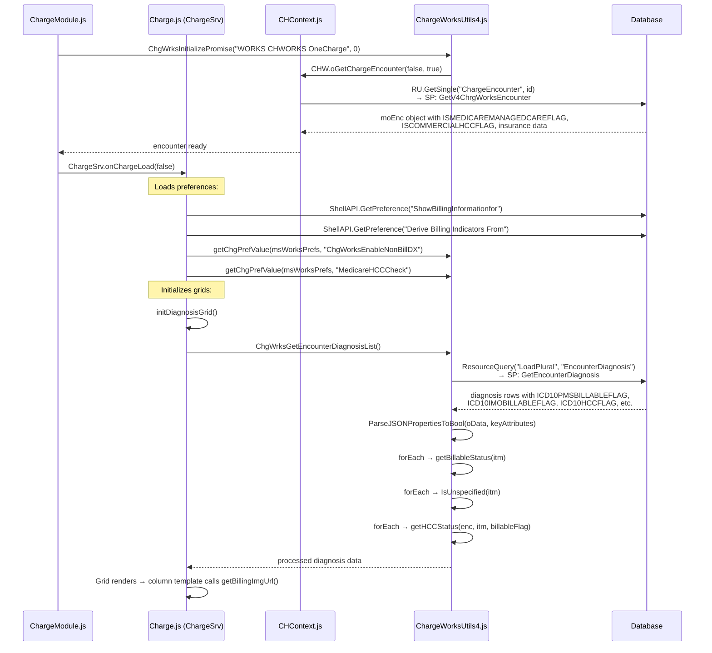
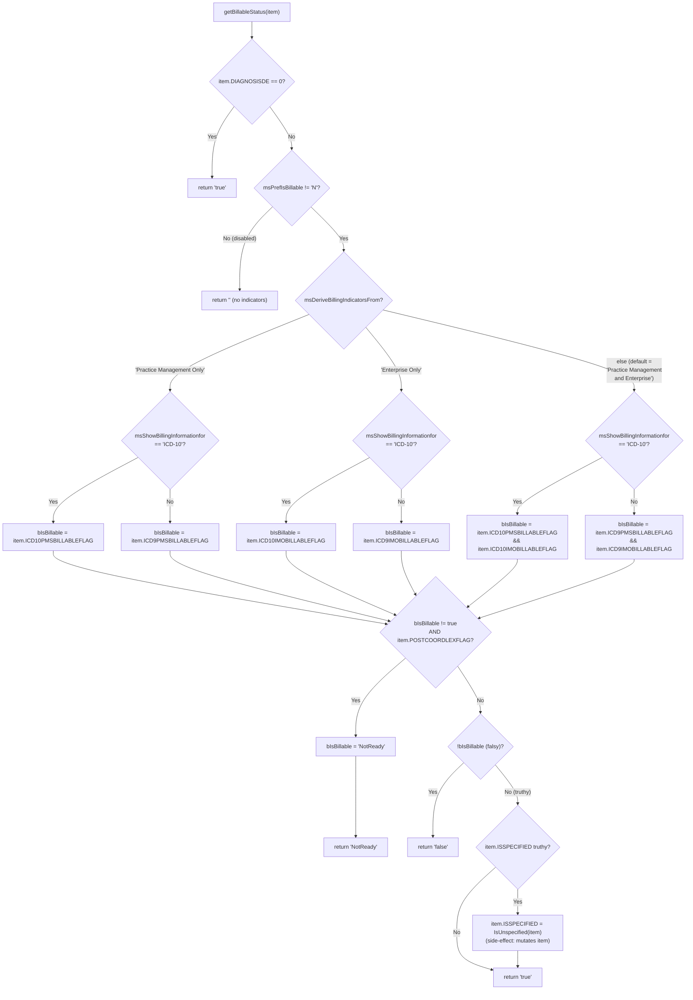
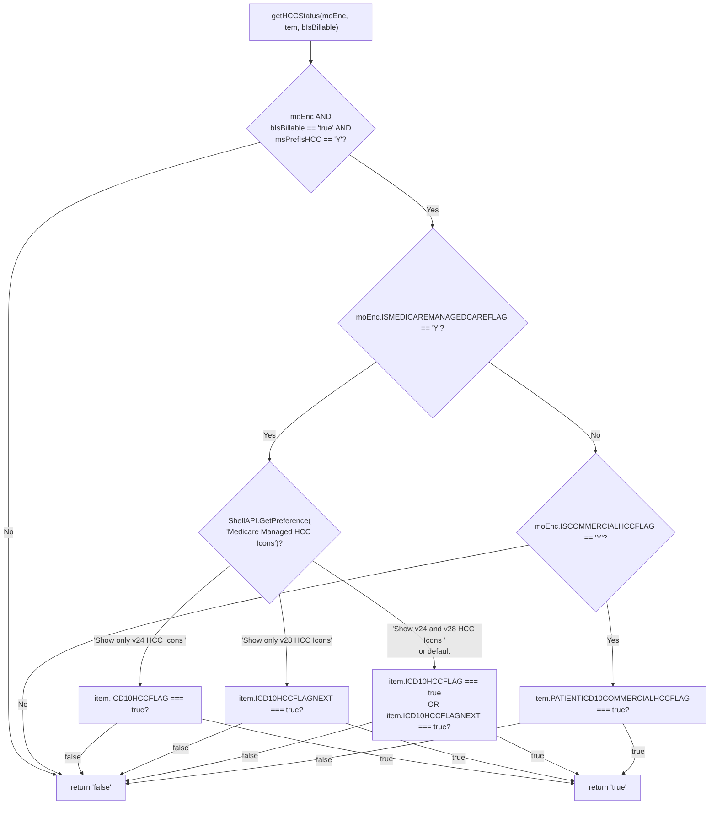
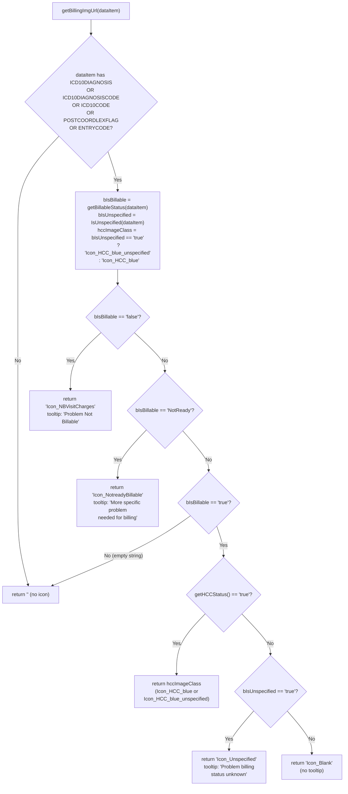
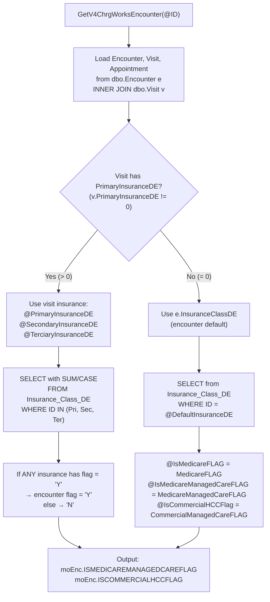

# Billing Indicators — Technical Developer Reference

## Architecture Overview



---

## Initialization Call Chain



---

## Preference Loading Details

| Preference Key                   | Loaded In                                        | API Call                             | Stored In Variable              | Possible Values                                                                                                              |
| -------------------------------- | ------------------------------------------------ | ------------------------------------ | ------------------------------- | ---------------------------------------------------------------------------------------------------------------------------- |
| `ShowBillingInformationfor`      | `Charge.js` `onChargeLoad()` line 467            | `ShellAPI.GetPreference(...)`        | `msShowBillingInformationfor`   | `"ICD-10"`, `"ICD-9"`                                                                                                        |
| `Derive Billing Indicators From` | `Charge.js` `onChargeLoad()` line 468            | `ShellAPI.GetPreference(...)`        | `msDeriveBillingIndicatorsFrom` | `"Practice Management Only"`, `"Enterprise Only"`, `"Practice Management and Enterprise"`                                    |
| `ChgWorksEnableNonBillDX`        | `Charge.js` `onChargeLoad()` line 469            | `getChgPrefValue(msWorksPrefs, ...)` | `msPrefIsBillable`              | `"N"` (off), `"Y"`, `"Non-billable codes not selectable"`                                                                    |
| `MedicareHCCCheck`               | `Charge.js` `onChargeLoad()` line 470            | `getChgPrefValue(msWorksPrefs, ...)` | `msPrefIsHCC`                   | `"Y"`, `"N"`                                                                                                                 |
| `Medicare Managed HCC Icons`     | `ChargeWorksUtils4.js` `getHCCStatus()` line 903 | `ShellAPI.GetPreference(...)`        | local in function               | `"Show only v24 HCC Icons "` (trailing space), `"Show only v28 HCC Icons"`, `"Show v24 and v28 HCC Icons "` (trailing space) |

Preferences are accessed at runtime via `ChargeSrv.getPreference(key)` which reads from the module-scoped variables in `Charge.js`.

In the Add Dx dialog, preferences are re-loaded independently in `ModalAddDxCharge.js` `vm.initContent()` (lines 104-113).

The DB source for preferences is the `AHSPreference` table, loaded via stored procedure `GetPreferencesByUserIDWithEnterpriseValue` (resource action ID 170, resource ID 48 `CMSPreference`).

---

## Core Function: `getBillableStatus(item)`

**File:** `ChargeWorksUtils4.js` lines 813-870

**Input:** A diagnosis data item with these properties (boolean after `ParseJSONPropertiesToBool`):

| Property               | Type    | Source                                    |
| ---------------------- | ------- | ----------------------------------------- |
| `DIAGNOSISDE`          | number  | Diagnosis dictionary entry ID             |
| `ICD10PMSBILLABLEFLAG` | boolean | PMS billable for ICD-10                   |
| `ICD9PMSBILLABLEFLAG`  | boolean | PMS billable for ICD-9                    |
| `ICD10IMOBILLABLEFLAG` | boolean | Enterprise/IMO billable for ICD-10        |
| `ICD9IMOBILLABLEFLAG`  | boolean | Enterprise/IMO billable for ICD-9         |
| `POSTCOORDLEXFLAG`     | boolean | Post-coordinated lexicon flag             |
| `ISSPECIFIED`          | string  | Pre-existing specificity (may be mutated) |

**Returns:** `"true"` | `"false"` | `"NotReady"` | `""` (empty = indicators disabled)



**Note:** When `bIsBillable` is the result of `&&` on two booleans, JavaScript returns `true`/`false` (boolean), not a string. The subsequent `bIsBillable != true` check works because `false != true` is `true`. If only one flag is used (PM Only or Enterprise Only), `bIsBillable` is directly a boolean from `ParseJSONPropertiesToBool`.

---

## Core Function: `IsUnspecified(item)`

**File:** `ChargeWorksUtils4.js` lines 871-897

**Returns:** `"true"` | `"false"`

**Key behavior:** Only evaluates when `msShowBillingInformationfor == "ICD-10"`. For ICD-9, always returns `"false"`.

| Derive From              | Property Checked           | Unspecified When              |
| ------------------------ | -------------------------- | ----------------------------- |
| Enterprise Only          | `item.ICD10IMOSPECIFICITY` | `== "1"`                      |
| Practice Management Only | `item.ICD10PMSSPECIFICITY` | `== "1"`                      |
| Both (else)              | Either property            | Either `== "1"` (uses `\|\|`) |

**Note on "Both" logic:** The `else` branch uses JavaScript `||` with the ternary expressions. If `ICD10IMOSPECIFICITY` is truthy and equals `"1"`, it returns `"true"`. Otherwise it falls through to check `ICD10PMSSPECIFICITY`.

---

## Core Function: `getHCCStatus(moEnc, item, bIsBillable)`

**File:** `ChargeWorksUtils4.js` lines 899-925

**Returns:** `"true"` | `"false"`

**Preconditions:** Only evaluates if ALL of:

- `moEnc` is truthy
- `bIsBillable == "true"` (string comparison)
- `ChargeSrv.getPreference("msPrefIsHCC") == "Y"`



**Note:** `ISMEDICAREMANAGEDCAREFLAG` takes priority. If both Medicare and Commercial flags are `"Y"`, only Medicare HCC logic runs (the Commercial branch is in `else if`).

---

## Core Function: `getBillingImgUrl(dataItem)`

**File:** `ChargeWorksUtils4.js` lines 1200-1230

Orchestrates the three core functions and maps results to CSS icon class names.



---

## Database: Encounter Insurance Flag Derivation

**Stored Procedure:** `dbo.GetV4ChrgWorksEncounter`

**File:** `Database/Objects/Clinical/Stored Procedures/dbo.GetV4ChrgWorksEncounter.prc`



**Table:** `dbo.Insurance_Class_DE` — columns: `MedicareFLAG`, `MedicareManagedCareFLAG`, `CommercialManagedCareFLAG`

---

## Database: Diagnosis Billable Flags

**Stored Procedure:** `GetEncounterDiagnosis` (resource action ID 269, resource `EncounterDiagnosis`)

Returns per-diagnosis properties used by client-side logic:

| Output Property                 | DB Source                                      | Description                                       |
| ------------------------------- | ---------------------------------------------- | ------------------------------------------------- |
| `ICD10PMSBILLABLEFLAG`          | `Problem_DE_ICDCode` JOIN `ICD10_Diagnosis_DE` | `'Y'` if active ICD-10 code mapping exists in PMS |
| `ICD10IMOBILLABLEFLAG`          | `ICD_Reference` WHERE `IsBillableFLAG = 'Y'`   | `'Y'` if Enterprise/IMO marks as billable         |
| `ICD9PMSBILLABLEFLAG`           | `Problem_DE_ICDCode` JOIN `ICD9_Diagnosis_DE`  | Same logic for ICD-9                              |
| `ICD9IMOBILLABLEFLAG`           | `ICD_Reference` WHERE `ICDType = 'ICD9CM'`     | Same logic for ICD-9                              |
| `POSTCOORDLEXFLAG`              | `ATP_IMOProbIT.Post_Coord_Lex_FLAG`            | Indicates code needs post-coordination            |
| `ICD10IMOSPECIFICITY`           | `ATP_IMOProbIT`                                | `1` = unspecified (Enterprise)                    |
| `ICD10PMSSPECIFICITY`           | `ATP_IMOProbIT`                                | `1` = unspecified (PMS)                           |
| `ICD10HCCFLAG`                  | Encounter Diagnosis query                      | V24 HCC category flag                             |
| `ICD10HCCFLAGNEXT`              | Encounter Diagnosis query                      | V28 HCC category flag                             |
| `PATIENTICD10COMMERCIALHCCFLAG` | Encounter Diagnosis query                      | Commercial HCC flag for patient                   |

Client-side parsing in `ChargeWorksUtils4.js` `ChgWrksGetEncounterDiagnosisList()` (lines 278-280):

```javascript
ParseJSONPropertiesToBool(oData, ['ICD10PMSBILLABLEFLAG', 'ICD10IMOBILLABLEFLAG',
  'POSTCOORDLEXFLAG', 'ICD10HCCFLAG', 'ICD10HCCFLAGNEXT', 'PATIENTICD10COMMERCIALHCCFLAG', ...])
```

Converts `"Y"`/`"N"` strings to `true`/`false` booleans before billing logic runs.

---

## Database: Server-Side Billable Derivation

**Stored Procedure:** `dbo.DeriveBillableIndicators`

**File:** `Database/Objects/Clinical/Stored Procedures/dbo.DeriveBillableIndicators.prc`

This SP mirrors the client-side `getBillableStatus()` logic and is used by orders/problems workflows. It reads the `Derive Billing Indicators From` and `ShowBillingInformationfor` preferences from the `AHSPreference` table and checks:

- **PMS Billable:** `Problem_DE_ICDCode` joined with `ICD10_Diagnosis_DE` — code must have an active mapping
- **Enterprise/IMO Billable:** `ICD_Reference` table — `IsBillableFLAG = 'Y'` for the code
- **"Practice Management and Enterprise":** Both checks must pass (AND logic)

---

## Display Integration Points

**1. Main Diagnosis Grid** — `Charge.js` `initDiagnosisGrid()` (lines 2265-2280):

- Column with `class: "imgDxGridColumn"` renders the billing icon
- Template calls `getBillingImgUrl(dataItem)` and `getBillingImgToolTip(imgClass, dataItem)`
- Data loaded via `loadDiagnosisGrid()` → `ChgWrksGetEncounterDiagnosisList()`

**2. Add Dx Search Grid** — `AddNewCharge.js` `$scope.dxColumns`:

- First column (`field: "ICD10DIAGNOSISCODE"`) renders `getBillableImageClass(dataItem)` via `ChargeWorksUtils4.js` line 1177
- Last checkmark column also calls `checkBillableDx(dataItem)` to apply `dxRowIconDisabledState` CSS

**3. Badge Tooltip** — `ModalAddDxCharge.js` `$scope.buildAddedItemsToolTip()` (lines 361-381):

- Calls `getBillableImageClass(excludeRemovedDxList[i])` per diagnosis
- Renders into `#dxToolTipContent` div

**4. Selectability Gate** — `ChargeWorksUtils4.js` `checkBillableDx(dxItm)` (lines 1721-1726):

- Returns `false` when `msPrefIsBillable == "Non-billable codes not selectable"` AND `getBillableStatus()` returns `"false"` or `"NotReady"`
- Used by `addOrRemoveItems()` in `AddNewCharge.js` to block selection

---

## Icon Constants Reference

| Constant                    | CSS Class                   | Tooltip Constant        | Tooltip Text                                                                                          |
| --------------------------- | --------------------------- | ----------------------- | ----------------------------------------------------------------------------------------------------- |
| `ICON_NOT_BILLABLE`         | `Icon_NBVisitCharges`       | `PROBLEMNOTBILLABLE`    | "Problem Not Billable"                                                                                |
| `ICON_NOT_READY`            | `Icon_NotreadyBillable`     | `PROBLEMNOTREADY`       | "More specific problem needed for billing"                                                            |
| `ICON_UNSPECIFIED`          | `Icon_Unspecified`          | `PROBLEMBILLINGUNKNOWN` | "Problem billing status unknown"                                                                      |
| `ICON_HCC_BLUE`             | `Icon_HCC_blue`             | via `getTooltip()`      | "V24 HCC Category" / "V28 HCC Category" / "Both V24 and V28 HCC Category" / "Commercial HCC Category" |
| `ICON_HCC_BLUE_UNSPECIFIED` | `Icon_HCC_blue_unspecified` | via `getTooltip(,true)` | HCC tooltip + `<br>` + "Problem billing status unknown"                                               |
| `ICON_BLANK`                | `Icon_Blank`                | (none)                  | No tooltip                                                                                            |

---

## Tooltip Logic: `getTooltip(dataItem, isunspecified)`

**File:** `ChargeWorksUtils4.js` lines 1232-1275

For **Medicare Managed Care** encounters, tooltip varies by HCC Icons preference:

| HCC Icons Preference | V24 Flag | V28 Flag | Tooltip                         |
| -------------------- | -------- | -------- | ------------------------------- |
| Show only v24        | true     | —        | "V24 HCC Category"              |
| Show only v28        | —        | true     | "V28 HCC Category"              |
| Show v24 and v28     | true     | true     | "Both V24 and V28 HCC Category" |
| Show v24 and v28     | true     | false    | "V24 HCC Category"              |
| Show v24 and v28     | false    | true     | "V28 HCC Category"              |

For **Commercial HCC** encounters: tooltip is "Commercial HCC Category" when `PATIENTICD10COMMERCIALHCCFLAG` is true.

If `isunspecified` is true, appends `<br>Problem billing status unknown` to the tooltip.

`getBillingImgToolTip()` dispatches to `getTooltip()` for HCC icons, and returns static strings for other icon types.

---

## File Reference

| File                                             | Path                                                                                 | Role                                                                                                                                                                                             |
| ------------------------------------------------ | ------------------------------------------------------------------------------------ | ------------------------------------------------------------------------------------------------------------------------------------------------------------------------------------------------ |
| ChargeModule.js                                  | `TW/UI/Web/Shell/scripts/ChargeModule.js`                                            | AngularJS module + `chargeController` — bootstraps workspace, calls `ChgWrksInitializePromise()`                                                                                                 |
| Charge.js                                        | `TW/UI/Web/Shell/scripts/frontpage/Charge.js`                                        | `ChargeSrv` IIFE — `onChargeLoad()` loads prefs, `initDiagnosisGrid()` renders billing icons                                                                                                     |
| ChargeWorksUtils4.js                             | `TW/UI/Web/Shell/scripts/frontpage/ChargeWorksUtils4.js`                             | `getBillableStatus()`, `IsUnspecified()`, `getHCCStatus()`, `getBillingImgUrl()`, `getBillingImgToolTip()`, `checkBillableDx()`, `getBillableImageClass()`, `ChgWrksGetEncounterDiagnosisList()` |
| ModalAddDxCharge.js                              | `TW/UI/Web/Shell/app/Modules/Dialogs/Charge/ModalAddDxCharge.js`                     | Add Dx/Charge modal controller — re-loads prefs in `vm.initContent()`, builds tooltip                                                                                                            |
| AddNewCharge.js                                  | `TW/UI/Web/Shell/scripts/frontpage/AddNewCharge.js`                                  | Search grid controller — `dxColumns` templates call billing icon functions                                                                                                                       |
| CHContext.js                                     | `TW/UI/Web/Shell/scripts/frontpage/CHContext.js`                                     | `oGetChargeEncounter()` → `oLoadEncounter()` → `RU.GetSingle("ChargeEncounter")`                                                                                                                 |
| ChgEnterprisePreferences.js                      | `TW/UI/Web/Shell/scripts/frontpage/ChgEnterprisePreferences.js`                      | Admin UI for enterprise billing prefs                                                                                                                                                            |
| ChargeDetail.js                                  | `TW/UI/Web/Shell/scripts/frontpage/ChargeDetail.js`                                  | Separate XML-based `getBillableStatus(ItemXML)` used in charge detail dialog                                                                                                                     |
| GetV4ChrgWorksEncounter.prc                      | `Database/Objects/Clinical/Stored Procedures/dbo.GetV4ChrgWorksEncounter.prc`        | Sets `ISMEDICAREMANAGEDCAREFLAG`, `ISCOMMERCIALHCCFLAG` from `Insurance_Class_DE`                                                                                                                |
| DeriveBillableIndicators.prc                     | `Database/Objects/Clinical/Stored Procedures/dbo.DeriveBillableIndicators.prc`       | Server-side billable derivation (used by orders/problems, mirrors client logic)                                                                                                                  |
| 808 Create TWResources And TWResourceActions.sql | `Database/Objects/TWCommon/Scripts/808 Create TWResources And TWResourceActions.sql` | Resource action mappings: ChargeEncounter (ID 39), EncounterDiagnosis, CMSPreference                                                                                                             |
